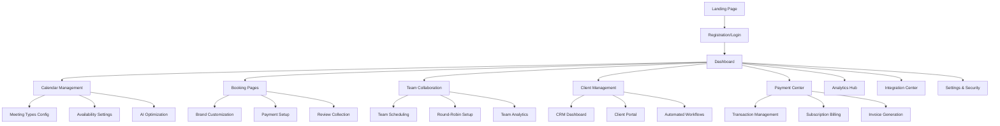

# SimpleCalendar Pro - Product Requirements Document

## 1. Product Overview

SimpleCalendar Pro is an AI-powered commercial scheduling platform that revolutionizes appointment booking with intelligent automation, seamless integrations, and advanced business features. <mcreference link="https://www.zencal.io/blog-posts/calendly-alternatives" index="2">2</mcreference> <mcreference link="https://6sense.com/tech/appointments-and-scheduling/calendly-market-share" index="3">3</mcreference>

The platform addresses critical pain points in the $14.33 billion scheduling software market by combining smart scheduling algorithms, comprehensive payment processing, and enterprise-grade analytics to help businesses maximize revenue and improve customer experience. <mcreference link="https://stripe.com/resources/more/booking-systems-with-payments-101-what-they-are-and-how-they-work" index="3">3</mcreference>

Target market includes freelancers, consultants, service providers, and enterprise teams seeking a competitive edge through intelligent scheduling automation and integrated business management tools.

## 2. Core Features

### 2.1 User Roles

| Role | Registration Method | Core Permissions |
|------|---------------------|------------------|
| Individual User | Email/OAuth registration | Personal scheduling, basic integrations, payment collection |
| Team Member | Invitation-based | Shared calendars, team scheduling, collaborative features |
| Team Admin | Upgrade from Individual | User management, team analytics, billing control, advanced settings |
| Enterprise Admin | Sales-assisted setup | Multi-team management, SSO, compliance controls, custom integrations |

### 2.2 Feature Module

Our SimpleCalendar Pro platform consists of the following essential pages:

1. **Dashboard**: AI-powered insights, revenue analytics, upcoming meetings overview, quick actions
2. **Calendar Management**: Availability settings, meeting types configuration, AI scheduling optimization
3. **Booking Pages**: Customizable branded scheduling interfaces, payment integration, review collection
4. **Team Collaboration**: Pooled scheduling, round-robin assignment, team performance analytics
5. **Client Management**: CRM functionality, client history, automated follow-ups, review management
6. **Payment Center**: Stripe/PayPal integration, invoicing, subscription management, revenue tracking
7. **Analytics Hub**: Meeting insights, revenue forecasting, performance optimization recommendations
8. **Integration Center**: Email providers, video conferencing, third-party app connections
9. **Settings & Security**: Account preferences, compliance controls, SSO configuration

### 2.3 Page Details

| Page Name | Module Name | Feature Description |
|-----------|-------------|---------------------|
| Dashboard | AI Insights Panel | Display predictive analytics for optimal scheduling times, revenue forecasts, and performance recommendations |
| Dashboard | Quick Actions | Create meetings, view today's schedule, access frequently used booking pages |
| Dashboard | Revenue Overview | Real-time revenue tracking, payment status, subscription metrics with visual charts |
| Calendar Management | Smart Availability | AI-powered availability optimization based on historical data and preferences |
| Calendar Management | Meeting Types | Configure duration, buffer times, pricing, video conferencing preferences with templates |
| Calendar Management | Time Zone Intelligence | Automatic detection and conversion with conflict prevention across zones |
| Booking Pages | Brand Customization | Upload logos, set colors, custom domains, personalized messaging with preview |
| Booking Pages | Payment Integration | Stripe/PayPal setup, deposit collection, subscription offerings, automated invoicing |
| Booking Pages | Review Collection | Post-meeting review requests, display testimonials, reputation management |
| Team Collaboration | Pooled Scheduling | Combine team availability, intelligent assignment algorithms, workload balancing |
| Team Collaboration | Round-Robin System | Fair distribution of meetings, skill-based routing, performance tracking |
| Team Collaboration | Team Analytics | Individual and team performance metrics, revenue attribution, optimization insights |
| Client Management | CRM Dashboard | Client profiles, meeting history, communication logs, relationship tracking |
| Client Management | Automated Workflows | Follow-up sequences, reminder customization, thank you page automation |
| Client Management | Client Portal | Self-service rescheduling, payment history, meeting preferences |
| Payment Center | Transaction Management | Payment processing, refund handling, dispute resolution, financial reporting |
| Payment Center | Subscription Billing | Recurring payment setup, plan management, usage tracking, billing automation |
| Payment Center | Invoice Generation | Automated invoicing, custom templates, payment tracking, tax compliance |
| Analytics Hub | Meeting Analytics | Booking patterns, conversion rates, no-show analysis, optimization recommendations |
| Analytics Hub | Revenue Intelligence | Revenue forecasting, payment analytics, subscription metrics, growth insights |
| Analytics Hub | Performance Optimization | AI-powered recommendations for pricing, scheduling, and customer retention |
| Integration Center | Email Sync | Gmail, Outlook, Exchange integration with two-way calendar synchronization |
| Integration Center | Video Conferencing | Zoom, Google Meet, Teams integration with automatic room generation |
| Integration Center | Third-Party Apps | CRM, marketing tools, productivity apps with webhook support |
| Settings & Security | Compliance Controls | GDPR, CCPA compliance tools, data retention policies, privacy settings |
| Settings & Security | SSO Configuration | Enterprise single sign-on, user provisioning, security policies |
| Settings & Security | API Management | Developer tools, webhook configuration, rate limiting, authentication |

## 3. Core Process

### Individual User Flow
1. User registers and completes onboarding with AI-guided setup recommendations
2. Configures availability using smart suggestions based on industry best practices
3. Creates branded booking pages with payment integration and review collection
4. Shares booking links through multiple channels (email, website, social media)
5. Receives bookings with automatic payment processing and calendar updates
6. Conducts meetings with one-click video conferencing access
7. Collects post-meeting reviews and processes automated follow-ups
8. Analyzes performance through AI-powered insights and optimization recommendations

### Team Admin Flow
1. Admin sets up team workspace with role-based permissions
2. Invites team members and configures pooled scheduling algorithms
3. Establishes round-robin assignment rules and skill-based routing
4. Monitors team performance through advanced analytics dashboard
5. Manages billing, subscriptions, and revenue distribution
6. Implements compliance controls and security policies
7. Optimizes team scheduling through AI recommendations

### Enterprise Flow
1. Enterprise admin configures SSO and user provisioning
2. Sets up multi-team hierarchies with custom permissions
3. Implements compliance controls and data governance policies
4. Integrates with existing CRM and business systems
5. Monitors organization-wide analytics and performance metrics
6. Manages enterprise billing and contract negotiations

## 4. User Interface Design

### 4.1 Design Style

- **Primary Colors**: Deep Blue (#1E40AF) for trust and professionalism, Emerald Green (#10B981) for success and growth
- **Secondary Colors**: Slate Gray (#64748B) for text, Light Blue (#DBEAFE) for backgrounds, Amber (#F59E0B) for warnings
- **Button Style**: Rounded corners (8px radius), subtle shadows, hover animations with color transitions
- **Typography**: Inter font family, 16px base size for body text, 24px+ for headings, excellent readability
- **Layout Style**: Card-based design with clean spacing, top navigation with sidebar for main sections
- **Icons**: Heroicons style with consistent stroke width, contextual colors, intuitive symbolism
- **Animations**: Smooth micro-interactions, loading states, success confirmations, subtle hover effects

### 4.2 Page Design Overview

| Page Name | Module Name | UI Elements |
|-----------|-------------|-------------|
| Dashboard | AI Insights Panel | Clean metric cards with data visualizations, color-coded performance indicators, interactive charts with hover details |
| Dashboard | Quick Actions | Prominent action buttons with icons, recent activity feed, contextual shortcuts based on user behavior |
| Calendar Management | Smart Availability | Interactive calendar grid, drag-and-drop time blocks, AI suggestion highlights with explanatory tooltips |
| Booking Pages | Brand Customization | Live preview panel, color picker with brand palette, drag-and-drop logo upload, mobile-responsive preview |
| Team Collaboration | Team Analytics | Performance dashboard with team member cards, progress bars, comparative metrics, drill-down capabilities |
| Payment Center | Transaction Management | Transaction table with filtering, status indicators, quick action buttons, detailed payment modals |
| Analytics Hub | Revenue Intelligence | Revenue charts with time period selectors, forecast visualizations, trend indicators, exportable reports |
| Integration Center | Connection Status | Integration cards with connection status, setup wizards, troubleshooting guides, sync indicators |

### 4.3 Responsiveness

The platform follows a mobile-first approach with adaptive design for desktop, tablet, and mobile devices. Touch-optimized interactions include larger tap targets, swipe gestures for navigation, and optimized forms for mobile input. Progressive web app capabilities ensure offline functionality and native app-like experience across all devices.

## 5. Advanced Features & Competitive Advantages

### 5.1 AI-Powered Intelligence
- **Smart Scheduling**: Machine learning algorithms analyze booking patterns to suggest optimal availability windows
- **Predictive Analytics**: Forecast meeting demand, revenue projections, and customer behavior trends
- **Conflict Resolution**: Automatic detection and resolution of scheduling conflicts with intelligent rescheduling suggestions
- **Dynamic Pricing**: AI-driven pricing recommendations based on demand, time slots, and market conditions

### 5.2 Comprehensive Payment Ecosystem
- **Multi-Gateway Support**: Stripe, PayPal, Square integration with automatic failover and optimization
- **Flexible Billing Models**: One-time payments, subscriptions, deposits, installments, and usage-based pricing
- **Revenue Optimization**: Dynamic pricing suggestions, discount management, and revenue forecasting
- **Global Payment Support**: 135+ currencies, local payment methods, tax compliance automation

### 5.3 Enhanced Customer Experience
- **Review Management**: Automated review collection, reputation monitoring, and testimonial showcase
- **Client Relationship Tools**: Comprehensive CRM, communication history, preference tracking
- **Personalization Engine**: Customized booking experiences based on client history and preferences
- **Multi-Language Support**: Localization for global markets with cultural considerations

### 5.4 Enterprise-Grade Security
- **Compliance Framework**: GDPR, CCPA, HIPAA compliance with automated data governance
- **Advanced Authentication**: SSO, MFA, role-based access control, audit logging
- **Data Protection**: End-to-end encryption, secure data storage, privacy controls
- **Enterprise Integration**: API-first architecture, webhook support, custom integrations

### 5.5 Business Intelligence
- **Advanced Analytics**: Customer lifetime value, churn prediction, revenue attribution
- **Performance Optimization**: AI-powered recommendations for pricing, scheduling, and operations
- **Competitive Intelligence**: Market benchmarking, industry insights, growth opportunities
- **Custom Reporting**: Flexible report builder, automated insights, executive dashboards

## 6. Technical Requirements

### 6.1 Performance Standards
- Page load times under 2 seconds globally
- 99.9% uptime SLA with redundant infrastructure
- Real-time synchronization across all connected calendars
- Scalable architecture supporting 10M+ users

### 6.2 Security Requirements
- SOC 2 Type II compliance
- End-to-end encryption for all data transmission
- Regular security audits and penetration testing
- GDPR and CCPA compliance by design

### 6.3 Integration Standards
- RESTful API with comprehensive documentation
- Webhook support for real-time notifications
- OAuth 2.0 for secure third-party integrations
- Rate limiting and API versioning

### 6.4 Compliance Considerations
- Data residency options for international customers
- Audit trails for all user actions and data changes
- Automated data retention and deletion policies
- Privacy-by-design architecture principles