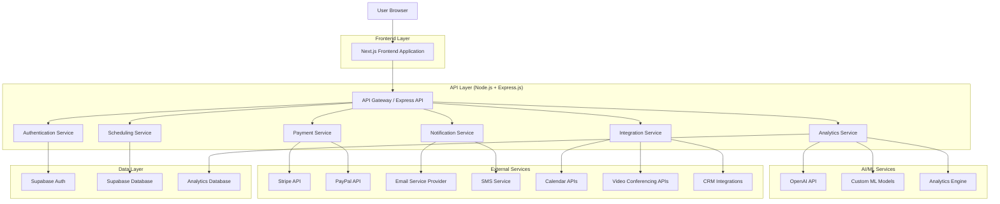
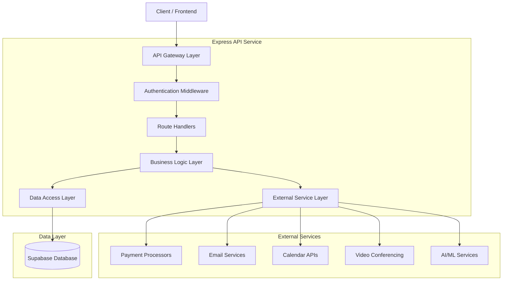
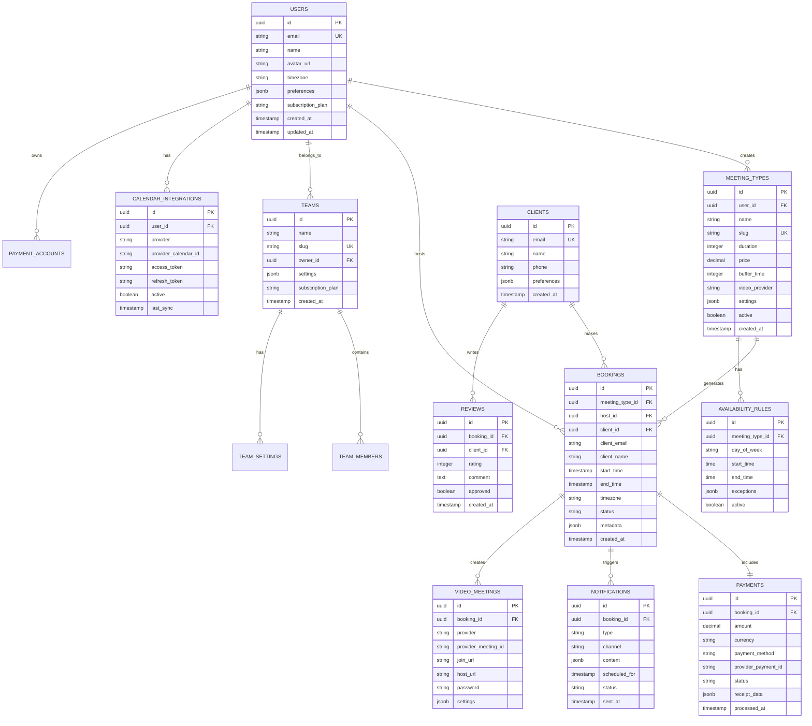
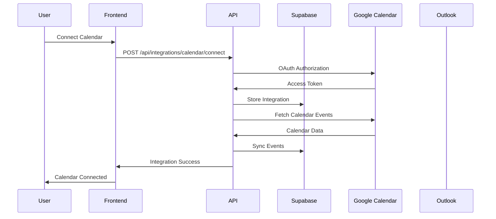
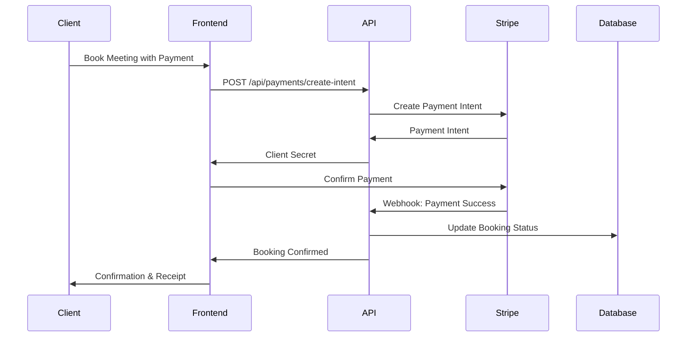
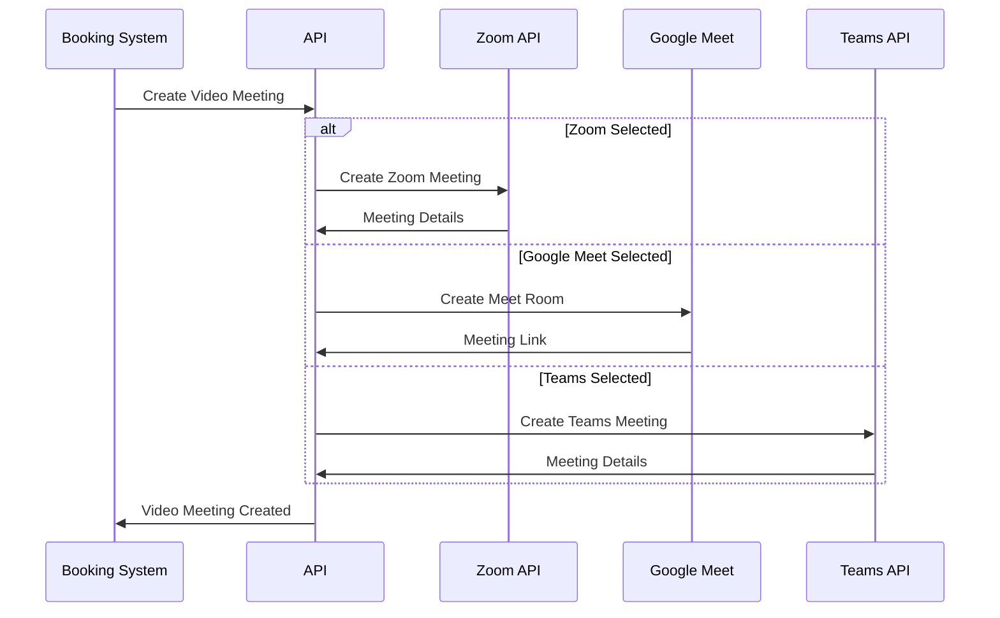

# SimpleCalendar Pro - Technical Architecture Document

## 1. Architecture Design



## 2. Technology Description

- **Frontend**: Next.js 16 + React 19 + TypeScript + Tailwind CSS + Framer Motion + TanStack Query
- **Backend**: Node.js 22 + Express.js 5 (modular API services)
- **Database**: Supabase (PostgreSQL) with real-time subscriptions
- **Authentication**: Supabase Auth with OAuth providers
- **Payment Processing**: Stripe + PayPal with webhook handling
- **File Storage**: Supabase Storage for assets and documents
- **Email Service**: Resend for transactional emails
- **Analytics**: Custom analytics service + Google Analytics 4
- **AI/ML**: OpenAI API + custom machine learning models
- **Monitoring**: OpenTelemetry-compatible metrics + Sentry for error tracking
- **CDN**: Vercel Edge Network for global performance

## 3. Route Definitions

| Route | Purpose |
|-------|---------|
| / | Landing page with product overview and pricing |
| /auth/login | User authentication with OAuth providers |
| /auth/register | User registration with onboarding flow |
| /dashboard | Main dashboard with AI insights and quick actions |
| /calendar | Calendar management and availability settings |
| /booking/[slug] | Public booking pages for clients |
| /meetings | Meeting management and history |
| /team | Team collaboration and management features |
| /clients | CRM dashboard and client management |
| /payments | Payment center and transaction management |
| /analytics | Advanced analytics and reporting |
| /integrations | Third-party service connections |
| /settings | Account settings and preferences |
| /admin | Enterprise admin panel (role-restricted) |
| /auth/callback | Supabase OAuth callback handling |
| /api/auth/session | Session inspection/refresh endpoints |
| /api/webhooks/[service] | Webhook handlers for external services |
| /api/scheduling/* | Scheduling and availability APIs |
| /api/payments/* | Payment processing APIs |
| /api/integrations/* | Third-party integration APIs |

## 4. API Definitions

### 4.1 Core Authentication APIs

**Session Validation**
```
GET /api/auth/session
```

Response:
| Param Name | Param Type | Description |
|------------|------------|-------------|
| authenticated | boolean | Session validity |
| user | object | Authenticated user profile |
| tenantId | string | Active tenant context |
| roles | array | Roles in active tenant |

Example:
```json
{
  "authenticated": true,
  "user": { "id": "uuid", "email": "user@example.com" },
  "tenantId": "tenant-uuid",
  "roles": ["admin"]
}
```

### 4.2 Scheduling APIs

**Create Meeting Type**
```
POST /api/scheduling/meeting-types
```

Request:
| Param Name | Param Type | isRequired | Description |
|------------|------------|------------|-------------|
| name | string | true | Meeting type name |
| duration | number | true | Duration in minutes |
| price | number | false | Price for paid meetings |
| bufferTime | number | false | Buffer time between meetings |
| videoProvider | string | false | Video conferencing provider |

Response:
| Param Name | Param Type | Description |
|------------|------------|-------------|
| id | string | Meeting type ID |
| slug | string | URL slug for booking page |
| settings | object | Meeting configuration |

**Get Availability**
```
GET /api/scheduling/availability
```

Query Parameters:
| Param Name | Param Type | isRequired | Description |
|------------|------------|------------|-------------|
| userId | string | true | User ID for availability check |
| startDate | string | true | Start date (ISO format) |
| endDate | string | true | End date (ISO format) |
| timezone | string | true | Client timezone |

Response:
| Param Name | Param Type | Description |
|------------|------------|-------------|
| availableSlots | array | Available time slots |
| conflicts | array | Conflicting appointments |
| suggestions | array | AI-powered optimal slots |

**Create Booking (Idempotent)**
```
POST /api/scheduling/bookings
```

Headers:
| Header | isRequired | Description |
|--------|------------|-------------|
| Idempotency-Key | true | Unique key for safe retry and dedupe |
| Authorization | conditional | Required for host-side protected flow |

Request:
| Param Name | Param Type | isRequired | Description |
|------------|------------|------------|-------------|
| tenantId | string | true | Tenant scope |
| meetingTypeId | string | true | Meeting type being booked |
| hostId | string | true | Host user ID |
| client | object | true | Client identity and timezone |
| startTime | string | true | Slot start timestamp (ISO) |
| endTime | string | true | Slot end timestamp (ISO) |
| metadata | object | false | Additional booking metadata |

Response:
| Param Name | Param Type | Description |
|------------|------------|-------------|
| bookingId | string | Created booking ID |
| status | string | Lifecycle state |
| idempotencyKey | string | Echoed idempotency key |
| nextAction | string | Next workflow step |

Related specs:
- `/docs/contracts/booking-create-api-contract.md`
- `/docs/scheduling/booking-lifecycle-and-idempotency.md`
- `/docs/testing/booking-race-condition-test-plan.md`

### 4.3 Payment APIs

**Create Payment Intent**
```
POST /api/payments/create-intent
```

Request:
| Param Name | Param Type | isRequired | Description |
|------------|------------|------------|-------------|
| tenantId | string | true | Tenant scope |
| bookingId | string | true | Associated booking ID |
| amount | number | true | Payment amount in cents |
| currency | string | true | Currency code (USD, EUR, etc.) |
| customer | object | false | Customer details for processor context |

Response:
| Param Name | Param Type | Description |
|------------|------------|-------------|
| paymentIntentId | string | Stripe payment intent ID |
| clientSecret | string | Client secret for Stripe confirmation |
| status | string | Payment status |
| bookingStatus | string | Booking lifecycle state after intent creation |

**Stripe Webhook**
```
POST /api/webhooks/stripe
```

Behavior:
- Verify webhook signature
- Deduplicate by provider `event_id`
- Apply payment and booking state transitions transactionally
- Persist audit trail and emit observability events

Related specs:
- `/docs/contracts/payment-intent-and-webhook-contract.md`
- `/docs/payments/webhook-reconciliation-design.md`
- `/docs/testing/payment-webhook-reliability-test-plan.md`

### 4.4 Integration APIs

**Calendar Sync**
```
POST /api/integrations/calendar/sync
```

Request:
| Param Name | Param Type | isRequired | Description |
|------------|------------|------------|-------------|
| provider | string | true | Calendar provider (google, outlook) |
| accessToken | string | true | OAuth access token |
| calendarId | string | true | Calendar ID to sync |

Response:
| Param Name | Param Type | Description |
|------------|------------|-------------|
| syncStatus | string | Synchronization status |
| eventsImported | number | Number of events imported |
| lastSync | string | Last sync timestamp |

**Google Calendar Connect**
```
POST /api/integrations/calendar/connect
POST /api/integrations/calendar/google/callback
POST /api/integrations/calendar/disconnect
GET /api/integrations/calendar/status
```

Status lifecycle:
- `connected`
- `initial_sync_in_progress`
- `healthy`
- `degraded`
- `reauth_required`
- `disconnected`

**Video Conference Creation**
```
POST /api/integrations/video/create
```

Request:
| Param Name | Param Type | isRequired | Description |
|------------|------------|------------|-------------|
| provider | string | true | Video provider (zoom, meet, teams) |
| meetingId | string | true | Internal meeting ID |
| startTime | string | true | Meeting start time |
| duration | number | true | Meeting duration in minutes |

Response:
| Param Name | Param Type | Description |
|------------|------------|-------------|
| joinUrl | string | Meeting join URL |
| hostUrl | string | Host control URL |
| meetingId | string | Provider meeting ID |
| password | string | Meeting password if required |

### 4.5 Notification APIs

**Send Notification**
```
POST /api/notifications/send
```

Request:
| Param Name | Param Type | isRequired | Description |
|------------|------------|------------|-------------|
| tenantId | string | true | Tenant scope |
| channel | string | true | `email` or `sms` |
| templateKey | string | true | Notification template identifier |
| recipient | object | true | Recipient target details |
| variables | object | true | Template variable map |
| metadata | object | false | Correlation identifiers |

Response:
| Param Name | Param Type | Description |
|------------|------------|-------------|
| notificationId | string | Notification record ID |
| status | string | Initial status (`queued`) |
| queueName | string | Queue used for async dispatch |

**Notification Status**
```
GET /api/notifications/:id/status
```

Status model:
- `queued`
- `processing`
- `sent`
- `delivered`
- `failed_transient`
- `failed_terminal`
- `suppressed`

Related specs:
- `/docs/contracts/notification-send-contract.md`
- `/docs/notifications/delivery-tracking-model.md`
- `/docs/testing/notification-pipeline-reliability-test-plan.md`

## 5. Server Architecture Diagram



## 6. Data Model

### 6.0 Multi-Tenant Baseline
- Tenant model: single database, shared schema, strict row-level isolation.
- Every tenant-bound business table includes `tenant_id UUID NOT NULL`.
- All tenant-bound reads/writes are scoped by `tenant_id`.
- RLS policies enforce tenant isolation by default.
- Public booking access is scoped to tenant/resource tokens.

### 6.1 Data Model Definition



### 6.2 Data Definition Language

**Users Table**
```sql
-- Create users table
CREATE TABLE users (
    id UUID PRIMARY KEY DEFAULT gen_random_uuid(),
    email VARCHAR(255) UNIQUE NOT NULL,
    name VARCHAR(100) NOT NULL,
    avatar_url TEXT,
    timezone VARCHAR(50) DEFAULT 'UTC',
    preferences JSONB DEFAULT '{}',
    subscription_plan VARCHAR(20) DEFAULT 'free' CHECK (subscription_plan IN ('free', 'pro', 'team', 'enterprise')),
    created_at TIMESTAMP WITH TIME ZONE DEFAULT NOW(),
    updated_at TIMESTAMP WITH TIME ZONE DEFAULT NOW()
);

-- Create indexes
CREATE INDEX idx_users_email ON users(email);
CREATE INDEX idx_users_subscription_plan ON users(subscription_plan);
```

**Meeting Types Table**
```sql
-- Create meeting_types table
CREATE TABLE meeting_types (
    id UUID PRIMARY KEY DEFAULT gen_random_uuid(),
    user_id UUID NOT NULL REFERENCES users(id) ON DELETE CASCADE,
    name VARCHAR(100) NOT NULL,
    slug VARCHAR(100) UNIQUE NOT NULL,
    duration INTEGER NOT NULL CHECK (duration > 0),
    price DECIMAL(10,2) DEFAULT 0,
    buffer_time INTEGER DEFAULT 0,
    video_provider VARCHAR(20) DEFAULT 'zoom' CHECK (video_provider IN ('zoom', 'meet', 'teams', 'none')),
    settings JSONB DEFAULT '{}',
    active BOOLEAN DEFAULT true,
    created_at TIMESTAMP WITH TIME ZONE DEFAULT NOW()
);

-- Create indexes
CREATE INDEX idx_meeting_types_user_id ON meeting_types(user_id);
CREATE INDEX idx_meeting_types_slug ON meeting_types(slug);
CREATE INDEX idx_meeting_types_active ON meeting_types(active);
```

**Bookings Table**
```sql
-- Create bookings table
CREATE TABLE bookings (
    id UUID PRIMARY KEY DEFAULT gen_random_uuid(),
    meeting_type_id UUID NOT NULL REFERENCES meeting_types(id),
    host_id UUID NOT NULL REFERENCES users(id),
    client_id UUID REFERENCES clients(id),
    client_email VARCHAR(255) NOT NULL,
    client_name VARCHAR(100) NOT NULL,
    start_time TIMESTAMP WITH TIME ZONE NOT NULL,
    end_time TIMESTAMP WITH TIME ZONE NOT NULL,
    timezone VARCHAR(50) NOT NULL,
    status VARCHAR(20) DEFAULT 'confirmed' CHECK (status IN ('confirmed', 'cancelled', 'completed', 'no_show')),
    metadata JSONB DEFAULT '{}',
    created_at TIMESTAMP WITH TIME ZONE DEFAULT NOW()
);

-- Create indexes
CREATE INDEX idx_bookings_host_id ON bookings(host_id);
CREATE INDEX idx_bookings_client_email ON bookings(client_email);
CREATE INDEX idx_bookings_start_time ON bookings(start_time);
CREATE INDEX idx_bookings_status ON bookings(status);
```

**Payments Table**
```sql
-- Create payments table
CREATE TABLE payments (
    id UUID PRIMARY KEY DEFAULT gen_random_uuid(),
    booking_id UUID NOT NULL REFERENCES bookings(id),
    amount DECIMAL(10,2) NOT NULL,
    currency VARCHAR(3) DEFAULT 'USD',
    payment_method VARCHAR(50) NOT NULL,
    provider_payment_id VARCHAR(255) UNIQUE NOT NULL,
    status VARCHAR(20) DEFAULT 'pending' CHECK (status IN ('pending', 'completed', 'failed', 'refunded')),
    receipt_data JSONB DEFAULT '{}',
    processed_at TIMESTAMP WITH TIME ZONE DEFAULT NOW()
);

-- Create indexes
CREATE INDEX idx_payments_booking_id ON payments(booking_id);
CREATE INDEX idx_payments_status ON payments(status);
CREATE INDEX idx_payments_provider_payment_id ON payments(provider_payment_id);
```

**Calendar Integrations Table**
```sql
-- Create calendar_integrations table
CREATE TABLE calendar_integrations (
    id UUID PRIMARY KEY DEFAULT gen_random_uuid(),
    user_id UUID NOT NULL REFERENCES users(id) ON DELETE CASCADE,
    provider VARCHAR(20) NOT NULL CHECK (provider IN ('google', 'outlook', 'exchange', 'icloud')),
    provider_calendar_id VARCHAR(255) NOT NULL,
    access_token TEXT NOT NULL,
    refresh_token TEXT,
    active BOOLEAN DEFAULT true,
    last_sync TIMESTAMP WITH TIME ZONE DEFAULT NOW(),
    created_at TIMESTAMP WITH TIME ZONE DEFAULT NOW()
);

-- Create indexes
CREATE INDEX idx_calendar_integrations_user_id ON calendar_integrations(user_id);
CREATE INDEX idx_calendar_integrations_provider ON calendar_integrations(provider);
CREATE INDEX idx_calendar_integrations_active ON calendar_integrations(active);
```

**Row Level Security (RLS) Policies**
```sql
-- Enable RLS on all tables
ALTER TABLE users ENABLE ROW LEVEL SECURITY;
ALTER TABLE meeting_types ENABLE ROW LEVEL SECURITY;
ALTER TABLE bookings ENABLE ROW LEVEL SECURITY;
ALTER TABLE payments ENABLE ROW LEVEL SECURITY;

-- Users can only access their own data
CREATE POLICY "Users can view own profile" ON users FOR SELECT USING (auth.uid() = id);
CREATE POLICY "Users can update own profile" ON users FOR UPDATE USING (auth.uid() = id);

-- Meeting types policies
CREATE POLICY "Users can view own meeting types" ON meeting_types FOR SELECT USING (auth.uid() = user_id);
CREATE POLICY "Users can manage own meeting types" ON meeting_types FOR ALL USING (auth.uid() = user_id);

-- Bookings policies
CREATE POLICY "Hosts can view their bookings" ON bookings FOR SELECT USING (auth.uid() = host_id);
CREATE POLICY "Hosts can manage their bookings" ON bookings FOR ALL USING (auth.uid() = host_id);

-- Grant permissions to authenticated users
GRANT SELECT, INSERT, UPDATE, DELETE ON users TO authenticated;
GRANT SELECT, INSERT, UPDATE, DELETE ON meeting_types TO authenticated;
GRANT SELECT, INSERT, UPDATE, DELETE ON bookings TO authenticated;
GRANT SELECT, INSERT, UPDATE, DELETE ON payments TO authenticated;

-- Grant read access to anonymous users for public booking pages
GRANT SELECT ON meeting_types TO anon;
```

## 7. Integration Architecture

### 7.1 Calendar Integration Flow


Integration references:
- `/docs/integrations/google-calendar-v1-design.md`
- `/docs/contracts/calendar-sync-api-contract.md`
- `/docs/testing/google-calendar-sync-and-conflict-test-plan.md`

### 7.2 Payment Processing Flow


### 7.3 Video Conference Integration


## 8. Performance & Scalability

### 8.1 Caching Strategy
- **Edge Caching**: Static assets and public booking pages cached at CDN level
- **API Caching**: Frequently accessed data cached with Redis-compatible storage
- **Database Caching**: Query result caching with automatic invalidation
- **Client-Side Caching**: TanStack Query for intelligent data fetching and caching

### 8.2 Database Optimization
- **Connection Pooling**: Supabase connection pooling for efficient database access
- **Read Replicas**: Geographic read replicas for global performance
- **Indexing Strategy**: Optimized indexes for common query patterns
- **Partitioning**: Time-based partitioning for large tables (bookings, analytics)

Database optimization references:
- `/docs/database/top-query-profiling-plan.md`
- `/docs/database/index-strategy-v1.md`
- `/docs/testing/db-latency-load-test-targets.md`

Initial latency targets:
- booking create transaction p95 <= 120ms
- availability query p95 <= 80ms
- webhook transition query group p95 <= 100ms

### 8.3 Monitoring & Observability
- **Application Monitoring**: OpenTelemetry-compatible metrics/traces
- **Error Tracking**: Sentry for error monitoring and alerting
- **Database Monitoring**: Supabase built-in monitoring and query analysis
- **Custom Metrics**: Business metrics tracking for KPIs and SLAs

Observability baseline standards:
- Logging standard: `/docs/observability/logging-standard.md`
- Metrics/traces dashboard specification: `/docs/observability/metrics-traces-dashboard-spec.md`
- Alert routing policy: `/docs/observability/alert-routing-policy.md`

Critical service-level telemetry:
- Booking success rate
- Payment webhook processing success/failure
- API p95 and p99 latency by route
- Queue depth, retry rates, and dead-letter counts

### 8.4 Security Measures
- **Authentication**: Supabase Auth with JWT tokens and refresh token rotation
- **Authorization**: Row-level security (RLS) policies for data access control
- **API Security**: Rate limiting, request validation, and CORS configuration
- **Data Encryption**: Encryption at rest and in transit for all sensitive data
- **Compliance**: GDPR, CCPA compliance with automated data governance

## 9. Background Job Infrastructure

### 9.1 Queue Topology
- `booking.events`
- `payment.webhooks`
- `notifications.send`
- `integrations.sync`
- `reconciliation.jobs`

### 9.2 Worker Runtime
- API layer enqueues jobs; worker layer processes asynchronously.
- Per-queue concurrency controls and tenant fairness guards.
- Trace/log context propagation for `request_id`, `tenant_id`, `job_id`.

### 9.3 Retry and DLQ
- Exponential backoff with jitter, bounded retries.
- Idempotency keys required for all jobs.
- Retry exhaustion routes job to dead-letter queue with failure metadata.
- DLQ alerts route through incident policy for critical queues.

Implementation references:
- `/docs/async/queue-and-worker-runtime.md`
- `/docs/async/retry-backoff-and-idempotency-policy.md`
- `/docs/async/dlq-handling-and-alerts.md`
